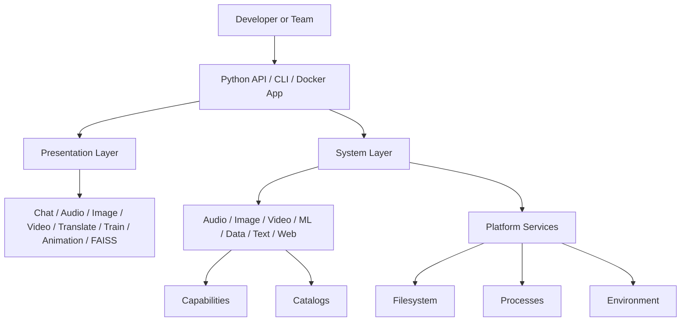
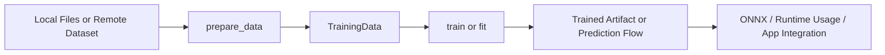
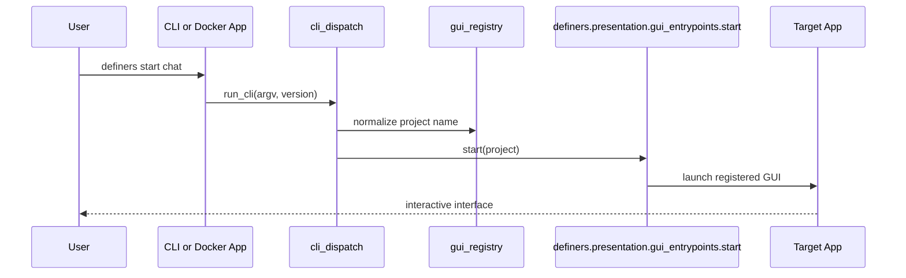
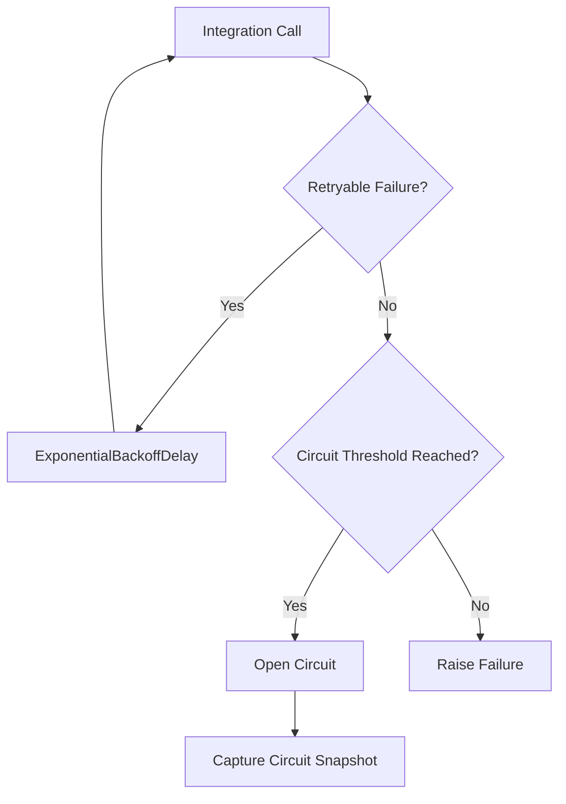

# Definers

Definers is a modular Python platform for building AI pipelines, multimodal media workflows, data preparation systems, and safe runtime automation from one codebase.

It is designed for developers, teams, and companies that need more than a narrow model wrapper or a one-off media script. Definers brings together audio, image, video, machine learning, NLP, web transfer, and platform-aware execution primitives behind a consistent Python-first API and launcher surface.

## Table Of Contents

1. [Positioning](#positioning)
2. [Why Definers](#why-definers)
3. [Capability Map](#capability-map)
4. [Architecture Diagrams](#architecture-diagrams)
5. [Installation](#installation)
6. [Quick Start](#quick-start)
7. [Applications And Launchers](#applications-and-launchers)
8. [Docker Workflows](#docker-workflows)
9. [Integrated API Reference](#integrated-api-reference)
10. [Reliability And Safety](#reliability-and-safety)
11. [Platform Requirements](#platform-requirements)
12. [Development Workflow](#development-workflow)
13. [Troubleshooting](#troubleshooting)
14. [Adoption Notes For Teams](#adoption-notes-for-teams)
15. [Contributing](#contributing)
16. [License](#license)

## Positioning

Definers is built for multimodal AI systems that need to move from experimentation to repeatable operation without changing toolsets. It gives you one repository and one package surface for:

- media analysis and transformation
- data preparation and training flows
- UI launchers and Dockerized applications
- resilient integrations and downloads
- safer command execution and platform-aware runtime handling

The project favors modular adoption. Teams can start with a narrow slice such as `definers.application_data.preparation`, `definers.system`, or one media domain, then expand into broader multimodal workflows when they are ready.

## Why Definers

Definers is built around a practical view of AI infrastructure: model work, media work, data work, and system work should cooperate instead of living in disconnected libraries.

| Project Value | What It Means In Practice |
| --- | --- |
| Unified multimodal surface | Audio, image, video, ML, NLP, web, and launcher flows live in one toolkit |
| Modular adoption | Optional dependency groups keep installs targeted instead of forcing the full stack |
| Operational guardrails | Retry, backoff, circuit-breaker, and guarded command execution are part of the public story |
| Deployment flexibility | The same project supports direct imports, CLI usage, installed app launching, and Docker app folders |
| Team-friendly growth | Start small, then expand into richer workflows without replacing the surrounding ecosystem |

## Capability Map

| Outcome | Primary Surface | Typical Work |
| --- | --- | --- |
| Launch multimodal apps | `definers.presentation.gui_entrypoints`, `definers.presentation.launchers`, CLI commands | Start chat, audio, image, video, translate, train, animation, and FAISS interfaces |
| Process and analyze audio | `definers.audio` | Feature extraction, mastering, stem separation, transcription, DSP, preview, synthesis |
| Transform images and video | `definers.image`, `definers.media.video_helpers` | Upscaling, feature extraction, reconstruction, composition, rendering |
| Prepare datasets and train models | `definers.application_data.preparation`, `definers.ml` | Loading, splitting, vectorization, tokenization, training, inference, export |
| Orchestrate resilient integrations | `definers.capabilities`, `definers.media.web_transfer` | Retry, circuit breakers, transfer orchestration, downloads |
| Run tools safely across environments | `definers.system` | Path handling, process execution, filesystem operations, runtime checks |

### Capability Coverage By Domain

| Domain | Core Public Entry Points | Representative Tasks |
| --- | --- | --- |
| Audio | `analyze_audio`, `analyze_audio_features`, `audio_preview`, `split_audio`, `remove_silence`, `compact_audio`, `separate_stems`, `separate_stem_layers`, `master`, `autotune_song`, `humanize_vocals` | Analysis, mastering, vocal finishing, cleanup, preview, stem separation, transcription, generation, mixing |
| Image | `extract_image_features`, `features_to_image`, `save_image`, `get_max_resolution` | Feature extraction, reconstruction, upscaling, export |
| Video | `features_to_video`, video UI and composition flows | Render pipelines, architect-style composition, media generation |
| Data | `prepare_data`, `fetch_dataset`, `files_to_dataset`, `create_vectorizer` | Data ingestion, batching, splitting, vectorization |
| ML | `train`, `fit`, `answer`, `extract_text_features` | Training, inference, prediction, feature conversion |
| Capabilities | `CircuitBreaker`, `ExponentialBackoffDelay`, `with_retry` | Resilience boundaries for unstable downstreams |
| Web | `download_file`, `download_and_unzip` | Safe transfer orchestration and download workflows |
| System | `run`, `run_linux`, `run_windows`, `secure_command` | Guarded command execution and runtime integration |

## Architecture Diagrams

### System Layout



### Data And Training Flow



### Launcher Flow



## Installation

### Installation Matrix

| Goal | Command |
| --- | --- |
| Base install | `pip install .` |
| Audio workflows | `pip install ".[audio]"` |
| Image workflows | `pip install ".[image]"` |
| Video workflows | `pip install ".[video]"` |
| ML workflows | `pip install ".[ml]"` |
| NLP workflows | `pip install ".[nlp]"` |
| Web and UI workflows | `pip install ".[web]"` |
| Full optional stack | `pip install ".[all]"` |
| Contributor toolchain | `pip install -e ".[dev]"` |
| CUDA extras | `pip install ".[cuda]" --extra-index-url https://pypi.nvidia.com` |

### Base Install

```bash
pip install .
```

### Targeted Extras

```bash
pip install ".[audio,ml,web]"
```

### Development Install

```bash
pip install -e ".[dev]"
```

### Windows Helper

Windows contributors can use [scripts/install.bat](scripts/install.bat), which prompts for install groups and includes the extra package index needed for NVIDIA-hosted packages.

### Dependency Group Reference

| Extra | Purpose | Notes |
| --- | --- | --- |
| `audio` | Audio analysis, DSP, separation, mastering, transcription, generation | Pulls in heavyweight audio and model dependencies |
| `image` | Image feature extraction, upscaling, reconstruction | Includes image and computer-vision dependencies |
| `video` | Video manipulation and rendering flows | Focused on video composition and export |
| `ml` | Model training, inference, embeddings, export | Includes substantial ML framework dependencies |
| `nlp` | Translation and language processing | Adds text and inference packages |
| `web` | Retrieval, scraping, Gradio UI, web utilities | Includes Gradio and scraping-related packages |
| `cuda` | GPU-oriented acceleration stack | Advanced path with host-level prerequisites |
| `all` | Aggregates the main domain extras | Does not include `dev` or `cuda` |
| `dev` | Pytest, Ruff, Poe, build, pre-commit, Vulture | Local contributor toolchain |

Definers is intentionally segmented so that narrow adoption does not require the entire dependency graph.

## Quick Start

### Prepare Data And Train A Model

```python
from definers.application_data.preparation import prepare_data
from definers.ml import train

dataset = prepare_data(
    features=["/path/to/features.csv"],
    drop=["unused_column"],
    stratify="label",
    val_frac=0.1,
    test_frac=0.1,
    batch_size=32,
)

print(dataset.metadata)

model_path = train(
    features=["/path/to/features.csv"],
    dataset_label_columns=["label"],
    order_by="shuffle",
    stratify="label",
    val_frac=0.1,
    test_frac=0.1,
    batch_size=32,
)

print(model_path)
```

### Train With AutoTrainer

```python
from definers.ml import AutoTrainer

trainer = AutoTrainer(batch_size=32)

model_path = trainer.train_url(
    "https://huggingface.co/datasets/owner/dataset",
    target="label",
    save_as="answer-model.joblib",
)

file_model_path = trainer.train_files(
    ["./features.csv"],
    target=["./labels.csv"],
    save_as="offline-model.joblib",
)

predictions = trainer.predict([[0.2, 0.4], [0.8, 0.6]])

print(model_path)
print(file_model_path)
print(predictions)
```

### Preview A Training Plan

```python
from definers.application_ml.trainer_plan import render_training_plan_markdown
from definers.ml import AutoTrainer

trainer = AutoTrainer(batch_size=16, source_type="parquet")
plan = trainer.training_plan(
    data="owner/dataset",
    target="label",
    label_columns="label",
    drop="unused_column",
    order_by="shuffle",
    select="1-200",
    stratify="label",
)

print(render_training_plan_markdown(plan))
```

### Launch The ML Studio

```bash
definers train
```

The `train` launcher opens a single ML studio surface for:

- training plans, remote/local training, and artifact resume flows
- saved-model prediction and task-based inference
- answer runtime execution from the ML facade
- text feature extraction, reconstruction, summary, and prompt tooling
- ML health inspection, K-means guidance, RVC checkpoint lookup, and model bootstrap actions

### Inspect ML Health

```python
from definers.ml import get_ml_health_snapshot, ml_health_markdown

snapshot = get_ml_health_snapshot()
print(snapshot.available_prediction_targets)
print(ml_health_markdown())
```

### Extract Audio Features

```python
from definers.audio import analyze_audio_features, extract_audio_features

summary = analyze_audio_features("/path/to/song.wav")
vector = extract_audio_features("/path/to/song.wav")

print(summary)
print(None if vector is None else vector.shape)
```

### Master Audio With Diagnostics

```python
from definers.audio import master

output_path, report = master(
    "./mix.wav",
    output_path="./mix-mastered.wav",
    preset="balanced",
    report_path="./mix-mastered-report.json",
)

print(output_path)
print(report.headroom_recovery_mode)
print(report.post_spatial_stereo_motion)
print(report.post_clamp_true_peak_dbfs)
```

Available mastering presets are `balanced`, `edm`, and `vocal`. When `preset` is omitted, `master()` auto-selects the default preset from the input audio; if you want to override that decision, pass `preset` explicitly.

`balanced` stays neutral, `edm` pushes the loudest and heaviest finish, and `vocal` keeps more openness, motion, and top-end air.

If you need to customize a preset, prefer the three macro mastering controls instead of low-level thresholds and timings. `SmartMasteringConfig` and the mastering kwargs expose `bass`, `volume`, and `effects`, each on a `0.0` to `1.0` scale. Higher `bass` means more bass weight and less treble emphasis, higher `volume` means a louder and denser master, and higher `effects` means more stereo motion, spatial polish, and dynamic finishing. The detailed compressor, stereo, delivery, and finishing parameters are derived automatically at access time from those three values.

```python
from definers.audio import master

output_path, report = master(
    "./mix.wav",
    output_path="./mix-mastered.wav",
    preset="balanced",
    effects=0.7,
)
```

The mastering path also adapts its repair intensity automatically for weak or legacy material: when a source is unusually dull, air-starved, almost mono, or closed and bass-loaded, it now rebalances more selectively by opening the upper bands, calming low-end compression pressure, and preserving more perceived air without requiring a separate preset.

For more aggressive production-style mastering, `master` first runs DEMUCS six-stem separation by default, applies role-specific mastering to drums, bass, vocals, guitar, piano, and the remaining music bed, rebalances those stems with drums intentionally forward and vocals slightly more restrained, saves the mastered stems into a sibling `*_stems` folder next to the final mix, remixes the processed stems, and then applies a final full-mix mastering pass.

The returned mastering report now exposes stage-aware diagnostics for post-spatial imaging, post-clamp true peak behavior, adaptive headroom recovery, and delivery verification so finishing changes can be inspected instead of guessed.

### Extract Image Features

```python
from definers.image import extract_image_features

features = extract_image_features("/path/to/image.png")
print(None if features is None else features.shape)
```

### Launch An Installed App

```python
from definers.presentation.launchers import launch_installed_project

launch_installed_project("chat")
```

### Run An External Tool Safely

```python
from definers.system import run

run(["ffmpeg", "-i", "input.mp4", "output.wav"])
```

### Add Retry Around An Unstable Integration

```python
from definers.capabilities import with_retry

@with_retry(max_attempts=3)
async def fetch_remote_resource():
    ...
```

## Applications And Launchers

Definers exposes both installed-project launchers and direct CLI dispatch for the same application registry.

GUI launch entry points live directly in `definers.presentation.gui_entrypoints`, while heavyweight media commands are imported from their dedicated presentation services.

### CLI Examples

```bash
python -m definers --help
definers --version
definers start chat
definers audio
definers translate
definers music-video /path/to/song.wav 1920 1080 30
definers lyric-video /path/to/song.wav /path/to/background.mp4 /path/to/lyrics.txt bottom
```

### Launchable Projects

| Project | Purpose | Startup Paths |
| --- | --- | --- |
| `chat` | Multimodal chat interface | CLI, installed launcher, Docker |
| `audio` | Mastering, vocal finishing, cleanup, preview, stem separation, and analysis workflows | CLI, installed launcher, Docker |
| `image` | Image generation and upscaling tools | CLI, installed launcher, Docker |
| `video` | Video composition and architect workflows | CLI, installed launcher, Docker |
| `animation` | Chunked image-to-animation workflow | CLI, installed launcher, Docker |
| `translate` | Translation and caption-oriented interface | CLI, installed launcher, Docker |
| `train` | Full ML studio for training, prediction, inference, answer runtime, text tooling, health checks, and model bootstrap | CLI, installed launcher, Docker |
| `faiss` | FAISS-oriented utility surface | CLI, installed launcher, Docker |

### Launcher Contracts

| Surface | Contract |
| --- | --- |
| `definers.presentation.cli_dispatch.run_cli(argv, version)` | Parses commands, normalizes app names, and routes to the right launcher or media command |
| `definers.presentation.launchers.launch_installed_project(project)` | Starts an installed application by project name |
| `definers.application_shell.command_parser.CliCommandParser.parse_cli_command(...)` | Normalizes incoming requests into typed command routing |
| `definers.presentation.music_video_service.music_video(...)` and `definers.presentation.lyric_video_service.lyric_video(...)` | Dedicated presentation media services for CLI and app flows |

## Docker Workflows

Each app folder under `docker/` contains a container entrypoint layout with `app.py`, `Dockerfile`, and `docker-compose.yml`.

```bash
cd docker/chat
docker compose up --build
```

The same folder shape exists for `audio`, `image`, `video`, `animation`, `translate`, `train`, and `faiss`.

| When To Use | Best Fit |
| --- | --- |
| Local import-heavy development | Install the package directly |
| Testing one app in an isolated runtime | Use the relevant Docker folder |
| Deployment-like app startup | Use Docker and the per-app container layout |

## Integrated API Reference

This section absorbs the former API specification document so the README can serve as the main technical front door.

### System Architecture Overview

Definers provides a modular utility toolkit with extension-oriented boundaries for reliability, data handling, media processing, and system orchestration.

### Core Capability Contracts

| API | Contract |
| --- | --- |
| `definers.capabilities.CircuitBreaker` | Sync and async operation gate with `CLOSED`, `OPEN`, and `HALF_OPEN` state transitions and runtime snapshots |
| `definers.capabilities.ExponentialBackoffDelay` | Configurable backoff strategy with base delay, multiplier, max delay, and jitter |
| `definers.capabilities.with_retry` | Async retry decorator with selective exception boundaries and deterministic re-raise behavior |
| `definers.media.web_transfer.ResourceRetrievalOrchestrator` | Strategy-driven transfer orchestration for integration-heavy workflows |

### Execution Patterns

| Pattern | Meaning |
| --- | --- |
| Resilience composition | Retry and circuit-breaker behavior can be layered to isolate unstable downstreams |
| Strategy-oriented integrations | Transfer and runtime boundaries are shaped around injectable strategies and protocols |
| Explicit failure surfaces | Runtime snapshots and typed failures are favored over silent degradation |

### Error Boundary Model



### Data Preparation Contracts

| API | Contract |
| --- | --- |
| `prepare_data(remote_src=None, features=None, labels=None, url_type=None, revision=None, drop=None, order_by=None, stratify=None, val_frac=0.0, test_frac=0.0, batch_size=1)` | Loads remote or local data, applies optional drops and ordering, performs train/val/test splitting, and returns `TrainingData` |
| `TrainingData` | Dataclass with `train`, `val`, `test`, and `metadata` |

### Audio Analysis Contracts

| API | Contract |
| --- | --- |
| `analyze_audio(audio_path, hop_length=1024, duration=None, offset=0.0)` | Returns dense waveform and frame-domain analysis data including tempo, beat frames, spectral data, RMS bands, and normalization helpers |
| `analyze_audio_features(audio_path, txt=True)` | Returns either a compact formatted summary such as `C major (120 bpm)` or a `(key, mode, tempo)` tuple |
| `extract_audio_features(file_path, n_mfcc=20)` | Returns an audio feature vector or `None` on load or extraction failure |

### Image Contracts

| API | Contract |
| --- | --- |
| `extract_image_features(image_path)` | Returns a visual feature vector or `None` if extraction fails |
| `features_to_image(predicted_features, image_shape=(1024, 1024, 3))` | Reconstructs an image-like frame from feature input when shape expectations are met |
| `get_max_resolution(width, height, mega_pixels=0.25, factor=16)` | Calculates a bounded factored resolution target |

### Public Import Pattern

Import concrete APIs from the implementation module you are using.

```python
from definers.application_data.preparation import prepare_data
from definers.ml import train
from definers.system import run
```

The package root is intentionally narrow. It mainly exposes version metadata plus the optional `sox` probe through `definers.sox` and `definers.has_sox()`.

### Catalog Contracts

| Registry | Contract |
| --- | --- |
| `definers.catalogs.languages.LANGUAGE_CODES` | Immutable language-code registry |
| `definers.catalogs.languages.UNESCO_MAPPING` | Immutable UNESCO mapping registry |
| `definers.catalogs.tasks.TASKS` | Immutable task-to-model registry consumed by constants |
| `definers.catalogs.references.USER_AGENTS` | Immutable user-agent registry |
| `definers.catalogs.references.STYLE_CATALOG` | Immutable style registry |

Import catalog registries from their concrete modules, such as `definers.catalogs.languages`, `definers.catalogs.references`, and `definers.catalogs.tasks`, instead of routing through a package-level gateway.

### Web Transfer Facades

| API | Contract |
| --- | --- |
| `definers.media.web_transfer.download_file(url, destination)` | Transfer orchestration for file download execution |
| `definers.media.web_transfer.download_and_unzip(url, extract_to)` | Transfer orchestration for download-and-extract workflows |

## Reliability And Safety

Operational guardrails are a first-class part of the design.

### Reliability Surface

| Concern | Public Surface | Why It Matters |
| --- | --- | --- |
| Unstable integrations | `with_retry`, `ExponentialBackoffDelay` | Reduces transient failure noise |
| Repeated downstream faults | `CircuitBreaker` | Prevents failure amplification and exposes state snapshots |
| Transfer orchestration | `definers.media.web_transfer` | Centralizes integration-heavy behavior and rejects archive path traversal during unzip |
| Platform differences | `run_linux`, `run_windows`, `run` | Makes runtime execution explicit |

### Safer Command Execution

All external command execution flows through `definers.system.run()` and its platform-specific delegates.

- Prefer list-form commands such as `["ffmpeg", "-i", "input.mp4", "output.wav"]`.
- Avoid free-form shell strings unless shell semantics are required deliberately.
- Guarded runtime execution rejects unsafe string command patterns such as shell separators in protected paths.

### Regex Hardening

Regex behavior is centralized in `definers.regex_utils` so user-facing pattern work can be constrained instead of compiled ad hoc.

### Optional Dependency Degradation

Some features fail lazily or degrade gracefully when optional dependencies are missing. A prominent example is `sox`, which is probed without forcing `import definers` itself to fail.

The multimodal answer path now follows the same pattern for media helpers: plain text requests do not require Pillow, `soundfile`, or `librosa` to import successfully, while image and audio helpers are loaded only when matching content paths appear in chat history.

The `definers.audio` facade now also resolves public exports lazily. Importing a narrow utility such as `value_to_keys` or `audio_preview` no longer pulls the full audio surface into memory up front.

### Guarded Serialized Model Loading

Pickle-backed model loads such as `.pkl` and `.joblib` now reject obvious HTML responses, Git LFS pointer files, and known dangerous reducer globals before deserialization starts.

If a serialized model load is blocked, regenerate the artifact from a trusted source instead of bypassing the guardrail.

## Platform Requirements

### Snapshot

| Area | Current State |
| --- | --- |
| Python requirement | `>=3.10` |
| Check workflow matrix | Python `3.10`, `3.11`, `3.12` |
| Quality workflow matrix | Python `3.10`, `3.11`, `3.12` |
| External tools | FFmpeg often required, `sox` sometimes required, CUDA host support optional |

### Practical Prerequisites

- FFmpeg is needed for many audio and video conversion paths.
- `sox` is optional but used in some audio conversion and loading flows.
- CUDA-oriented installs require host-level NVIDIA support beyond Python packages alone.
- Some extras pull direct Git dependencies and heavyweight frameworks, so installation time and environment complexity can rise quickly.

## Development Workflow

Definers includes a contributor-oriented Python quality pipeline.

### Local Setup

```bash
pip install -e ".[dev]"
```

### Main Validation Pipeline

```bash
poe check
```

`poe check` runs cleanup, compile verification, dead-code scanning, source sanitization, pre-commit hooks, tests, and a final cleanup pass.

### Focused Commands

```bash
poe test
poe lint
poe format
poe build
poe hook
poe cli-health
poe answer-simulations
poe ml-health
```

When iterating on multimodal answer behavior, prefer a focused regression pass before the full suite.

```bash
pytest tests/test_application_ml_answer_services.py tests/test_application_ml_answer_history_preparer.py tests/test_answer.py -q
```

When iterating on CLI routing, registry stability, or launcher wiring, use the dedicated health check.

```bash
poe cli-health
```

When iterating on training flows, AutoTrainer behavior, or workspace bootstrap for AI developers, use the ML-focused health and DX suite.

```bash
poe ml-health
```

### CI Validation Story

| Workflow | Purpose |
| --- | --- |
| `check.yml` | Pull-request gate across Python `3.10`, `3.11`, and `3.12` with `poe check` |
| `quality.yml` | Push and manual quality validation including lint, format check, and tests |
| Additional workflows | Publish, CodeQL, dependency review, stale automation, and repository maintenance |

## Troubleshooting

### `sox` Is Missing

`sox` is optional. Some audio-loading paths return `None` or fail only when the capability is used. Install the binary and place it on `PATH` if your workflow depends on it.

### FFmpeg Commands Fail

Install FFmpeg and ensure it is available on `PATH`. Definers can help orchestrate FFmpeg-driven workflows, but it cannot supply the binary automatically in every environment.

### CUDA Setup Is Difficult

Treat `cuda` as an advanced path. Start with CPU-oriented or non-CUDA extras first, confirm your workflows, then layer in CUDA once host prerequisites are proven.

### Heavy Extras Install Slowly

Install only the extras you need. The project is intentionally segmented so narrow adoption does not require the full stack.

### Hugging Face Model URLs Or Sharded Files Fail To Load

Prefer a Hugging Face repo id, a `resolve` URL, or even a copied `blob` URL. Definers now normalizes Hugging Face references through the Hub client instead of treating them as generic web downloads.

If a model is split into numbered files such as `model-001.safetensors`, `model-002.safetensors`, or `001-model.safetensors`, Definers can discover sibling shards automatically from the shared prefix or suffix around the numeric segment. For Hugging Face repositories it also checks index manifests when they exist.

If you are using a non-Hugging Face HTTP source, prefer raw artifact URLs rather than HTML pages. Definers rejects obvious HTML and Git LFS pointer downloads before deserialization.

For `.pkl` and `.joblib` artifacts, Definers also blocks known code-execution reducers during deserialization. Re-export the model from a trusted environment if an older or untrusted artifact is rejected.

### A Shell Command Works Outside `run()` But Not Inside It

Prefer list-form execution. If you need shell syntax, explicitly invoke the shell you intend to use.

## Adoption Notes For Teams

Definers is easiest to adopt incrementally.

1. Start with one slice such as `definers.application_data.preparation`, `definers.system`, or a single media domain.
2. Add extras when the team is ready to absorb the relevant runtime and model dependencies.
3. Standardize on the shared launcher and resilience surfaces as workflows expand.

That incremental adoption path is one of the project's strongest characteristics: teams can begin with a focused utility layer and grow into a broader multimodal platform without changing ecosystems.

## Contributing

Contributor workflow now lives in [CONTRIBUTING.md](CONTRIBUTING.md). Use that guide for Python environment setup, local validation, branch hygiene, and pull request expectations.

## License

Definers is licensed under the MIT License.

- Allowed: private use, commercial use, modification, redistribution, and deployment.
- Required: preservation of copyright and license notices.
- Not provided: warranty, liability coverage, or fitness guarantees.

See `LICENSE` for the full terms.

## Maintainer

Definers is owned and maintained by Yaron Koresh. Contributions are welcome through issues and pull requests.
